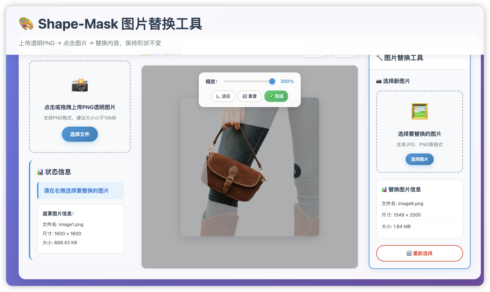

# Shape-Mask 图片替换工具 (纯前端实现)

> **WW-AI-Lab 实验项目** - AI辅助开发的交互式图片处理工具  
> 本项目完全由 AI（Cursor IDE + Claude）辅助完成，展示现代Web技术在图像处理领域的应用潜力。

[](https://opensource.org/licenses/MIT)
[](https://github.com/WW-AI-Lab)
[](https://developer.mozilla.org/en-US/docs/Web/API/Canvas_API)

一个强大的**交互式图片替换工具**，基于形状遮罩裁剪技术：  
1. **上传透明PNG** → 作为形状遮罩（mask）  
2. **点击图片** → 激活替换模式  
3. **选择新图片** → 实时预览替换效果  
4. **拖拽调整位置** → 缩放控制大小  
5. **一键完成** → 下载完美裁剪结果

✨ **特色功能**：所见即所得的实时预览、拖拽移动、智能缩放、现代化UI



---

## 🗂️ 项目结构

```
shape-mask-demo/
├─ index.html              # 主页面：现代化三栏布局
├─ app.js                  # 核心逻辑：模块化架构 + 交互控制
├─ style.css              # 样式：响应式设计 + 毛玻璃效果
├─ docs/
│  └─ development-plan.md  # 开发规划：详细的功能实现计划
└─ README.md              # 项目说明
```

---

## 🚀 快速开始

### 方法一：直接运行
1. **下载项目** 到本地  
2. 双击 `index.html` 或使用任何静态服务器  
3. 开始使用！

### 方法二：本地服务器
```bash
# 使用Python
python -m http.server 8000

# 使用Node.js
npx serve .

# 使用VS Code Live Server
# 右键 index.html → Open with Live Server
```

### 使用步骤
1. **上传遮罩图片**：选择PNG透明图片作为形状模板
2. **点击图片**：点击Canvas中的图片激活替换模式
3. **选择替换图片**：在右侧面板上传要替换的图片
4. **调整效果**：
   - 🖱️ **拖拽移动**：直接拖拽调整图片位置
   - 📏 **缩放控制**：使用滑块或快捷按钮调整大小
   - 👁️ **实时预览**：所有调整立即显示效果
5. **完成替换**：点击"完成"按钮生成最终结果
6. **下载保存**：一键下载PNG格式结果

---

## ✨ 核心特性

### 🎯 交互体验
- **点击激活**：只有点击Canvas中的图片才显示替换工具
- **拖拽移动**：鼠标直接拖拽调整替换图片位置
- **实时预览**：所有调整立即反映在Canvas上
- **智能缩放**：自动计算最佳缩放比例 + 手动精调

### 🎨 视觉效果
- **半透明遮罩**：遮罩区域高亮显示，其他区域半透明
- **现代化UI**：毛玻璃效果、平滑动画、响应式布局
- **状态反馈**：清晰的操作提示和进度显示

### ⚡ 技术特点
- **零依赖**：纯原生JavaScript + HTML5 Canvas
- **模块化架构**：清晰的代码组织和状态管理
- **高性能**：实时预览无卡顿，支持大尺寸图片
- **跨平台**：支持所有现代浏览器

---

## 🔧 实现核心

### 基础裁剪算法
```js
// 使用Canvas合成操作实现形状遮罩裁剪
function cropImageWithMask(maskImg, srcImg, scale = 1, offsetX = 0, offsetY = 0) {
    const canvas = document.createElement('canvas');
    const ctx = canvas.getContext('2d');
    
    // 设置Canvas尺寸为遮罩尺寸
    canvas.width = maskImg.width;
    canvas.height = maskImg.height;
    
    // 计算替换图片的位置和大小
    const scaledWidth = srcImg.width * scale;
    const scaledHeight = srcImg.height * scale;
    const x = (canvas.width - scaledWidth) / 2 + offsetX;
    const y = (canvas.height - scaledHeight) / 2 + offsetY;
    
    // 绘制替换图片
    ctx.drawImage(srcImg, x, y, scaledWidth, scaledHeight);
    
    // 使用destination-in混合模式，只保留遮罩形状内的内容
    ctx.globalCompositeOperation = 'destination-in';
    ctx.drawImage(maskImg, 0, 0);
    
    return canvas;
}
```

### 实时预览效果
```js
// 生成带半透明效果的预览
function previewReplaceWithScale(maskImg, srcImg, scale, offsetX, offsetY) {
    const canvas = document.createElement('canvas');
    const ctx = canvas.getContext('2d');
    
    // 1. 绘制半透明背景
    ctx.globalAlpha = 0.3;
    ctx.drawImage(srcImg, x, y, scaledWidth, scaledHeight);
    
    // 2. 绘制完整图片
    ctx.globalAlpha = 1;
    ctx.drawImage(srcImg, x, y, scaledWidth, scaledHeight);
    
    // 3. 应用遮罩裁剪
    ctx.globalCompositeOperation = 'destination-in';
    ctx.drawImage(maskImg, 0, 0);
    
    // 4. 添加半透明背景层
    ctx.globalCompositeOperation = 'destination-over';
    ctx.globalAlpha = 0.3;
    ctx.drawImage(srcImg, x, y, scaledWidth, scaledHeight);
    
    return canvas;
}
```

### 拖拽交互处理
```js
// Canvas拖拽事件处理
canvas.addEventListener('mousemove', (e) => {
    if (!isDragging) return;
    
    const rect = canvas.getBoundingClientRect();
    const currentX = e.clientX - rect.left;
    const currentY = e.clientY - rect.top;
    
    // 计算偏移量（考虑Canvas显示缩放）
    const displayScale = canvas.offsetWidth / canvas.width;
    replaceOffsetX += (currentX - dragStartX) / displayScale;
    replaceOffsetY += (currentY - dragStartY) / displayScale;
    
    // 实时更新预览
    updateReplacePreview();
});
```

---

## 📋 技术架构

### 模块化设计
```js
// 应用状态管理
const AppState = {
    INITIAL: 'initial',        // 初始状态
    MASK_LOADED: 'mask_loaded', // 遮罩已加载
    TOOL_ACTIVE: 'tool_active', // 工具激活
    PROCESSING: 'processing',   // 处理中
    COMPLETED: 'completed'      // 完成
};

// 核心模块
const FileManager = { /* 文件处理 */ };
const CanvasRenderer = { /* Canvas渲染 */ };
const ImageProcessor = { /* 图像处理 */ };
const UIController = { /* 界面控制 */ };
const EventHandlers = { /* 事件处理 */ };
```

### 关键技术点

| 技术 | 应用 | 说明 |
|------|------|------|
| `globalCompositeOperation` | 形状裁剪 | `destination-in`实现遮罩效果 |
| `URL.createObjectURL` | 文件读取 | 零拷贝文件处理 |
| `Canvas API` | 图像处理 | 高性能图像合成和变换 |
| `事件委托` | 交互控制 | 优化的鼠标和拖拽处理 |
| `模块化架构` | 代码组织 | 清晰的职责分离和状态管理 |

---

## 🌐 浏览器支持

- ✅ **Chrome 61+**
- ✅ **Edge 79+**  
- ✅ **Firefox 60+**
- ✅ **Safari 11+**

> 支持所有现代浏览器，无需任何polyfill

---

## 🛠️ 扩展方向

### 已实现功能
- [x] 基础形状遮罩裁剪
- [x] 交互式图片替换
- [x] 拖拽移动调整
- [x] 缩放控制
- [x] 实时预览
- [x] 现代化UI设计
- [x] 响应式布局

### 可扩展功能
- [ ] **旋转控制**：添加图片旋转功能
- [ ] **多图层支持**：支持多个替换图片叠加
- [ ] **滤镜效果**：添加色彩调整、模糊等效果
- [ ] **批量处理**：Web Worker + OffscreenCanvas
- [ ] **历史记录**：撤销/重做操作
- [ ] **模板库**：预设形状模板
- [ ] **导出选项**：多种格式和尺寸导出

### 性能优化
```js
// 建议的优化方向
- OffscreenCanvas：大图片处理
- Web Worker：批量操作
- WebAssembly：复杂图像算法
- IndexedDB：本地缓存
```

---

## 📁 项目文档

- **[开发规划](./docs/development-plan.md)**：详细的功能实现计划和进度跟踪
- **代码注释**：完整的函数和模块说明
- **Git提交历史**：清晰的开发过程记录

---

## 📄 开源协议

**MIT License** — 随意商用、改造，欢迎贡献代码！

如果这个项目对你有帮助，请给个 ⭐ Star 支持一下！

---

## 🤖 关于 WW-AI-Lab

这是 **[WW-AI-Lab](https://github.com/WW-AI-Lab)** 的实验项目，我们专注于：

- 🔄 **企业自动化解决方案** - 浏览器自动化、AI工作流
- 🤖 **Agentic Workflow** - 端到端的AI业务流程
- 🖼️ **生成式AI应用** - 多模态模型、图像处理
- 📊 **数据洞察工具** - AI驱动的数据分析

### 💡 项目特点
- **AI辅助开发**: 本项目完全由 Cursor IDE + Claude 协作完成
- **生产就绪**: 虽是实验项目，但代码质量达到生产标准
- **开源共享**: 包含完整的开发过程文档和 Cursor Rules
- **学习友好**: 详细的技术实现说明，便于学习和改进

### 🚀 从原型到生产
当实验项目在实践中证明有效时，我们会将其升级为生产级方案并迁移到企业级组织：  
👉 **[YFGaia](https://github.com/YFGaia)** - 提供更严谨的测试、文档与长期维护

### 📞 联系我们

| 渠道 | 地址 | 用途 |
|------|------|------|
| 📧 **Email** | [toxingwang@gmail.com](mailto:toxingwang@gmail.com) | 合作 / 业务咨询 |
| 🐦 **X (Twitter)** | [@WW_AI_Lab](https://x.com/WW_AI_Lab) | 最新动态、技术分享 |
| 💬 **微信** | toxingwang | 深度交流，添加请注明来源 |

---

**免责声明**: 本项目仅用于学习与验证技术思路，不保证生产环境可用性。如需商用支持，请通过上述渠道联系。
